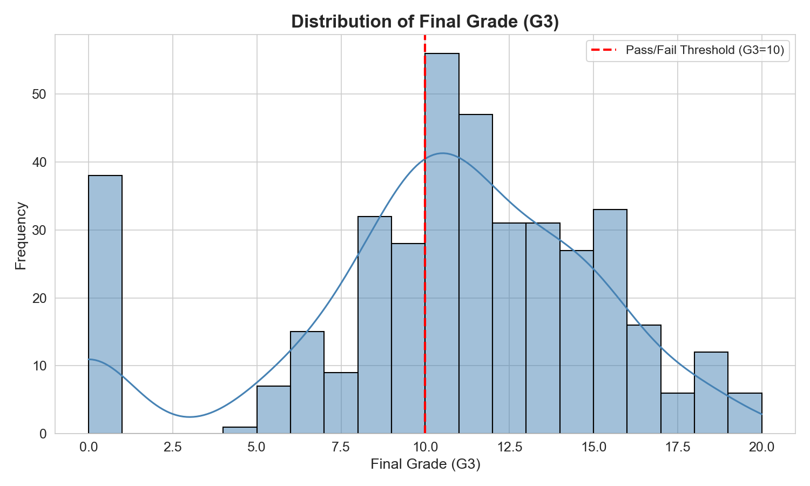
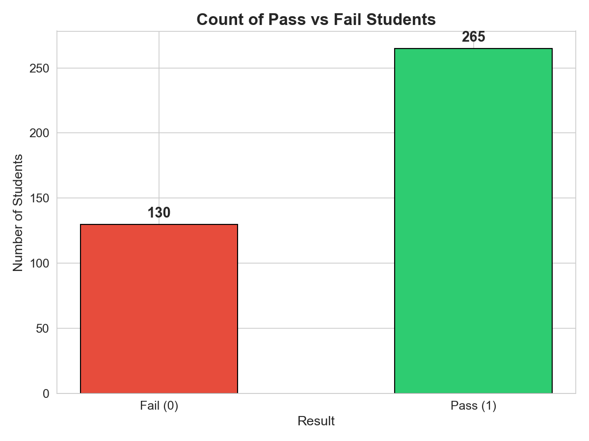
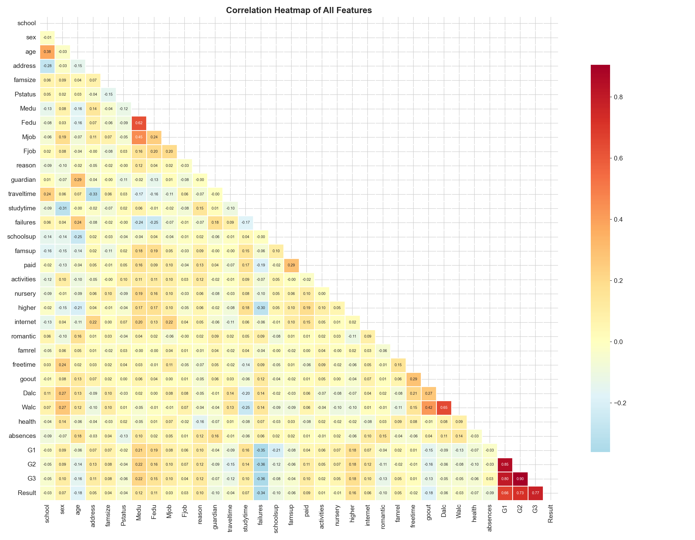
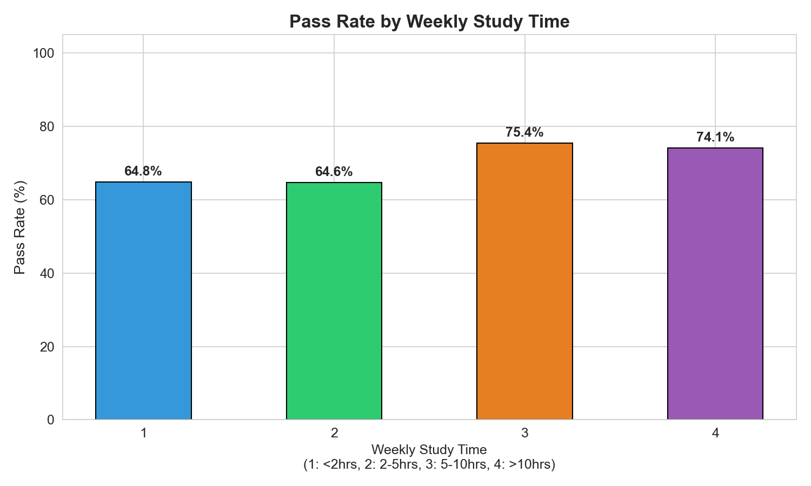
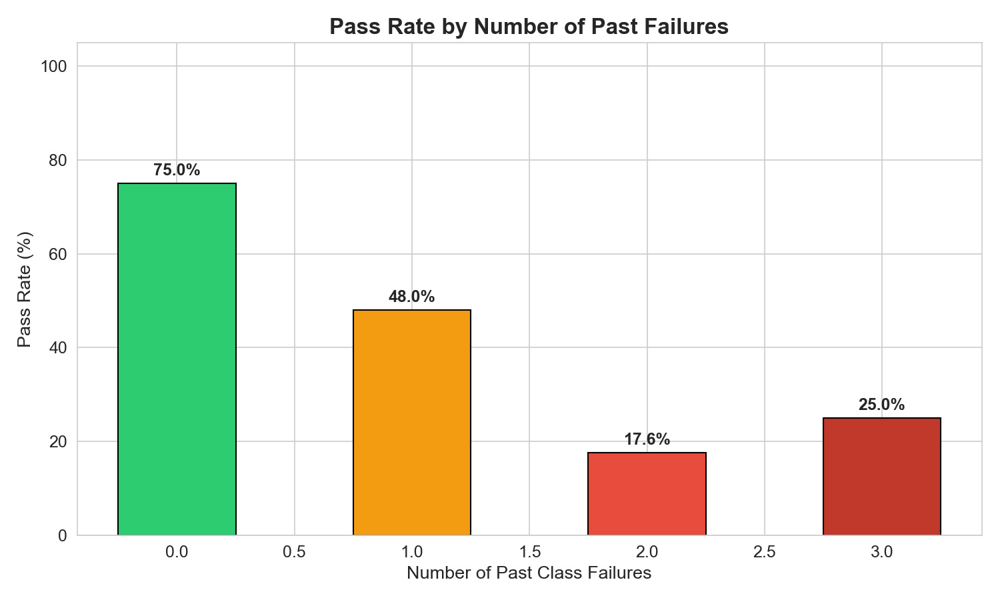
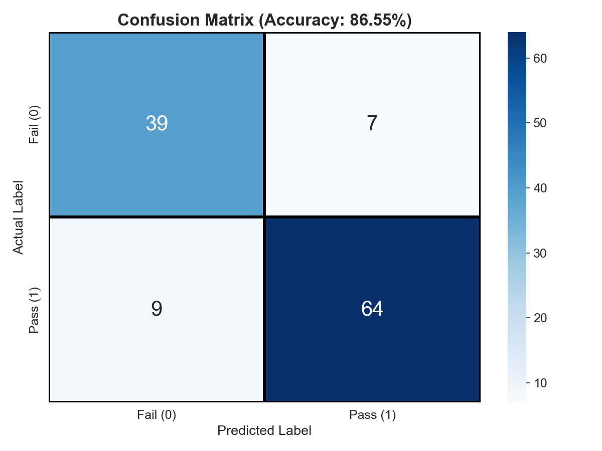
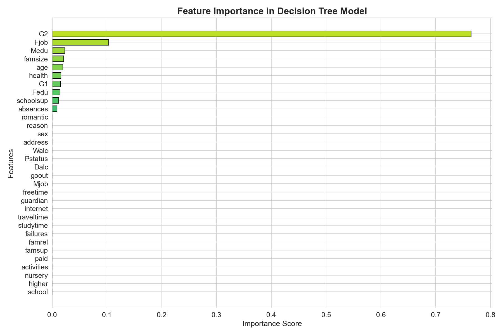
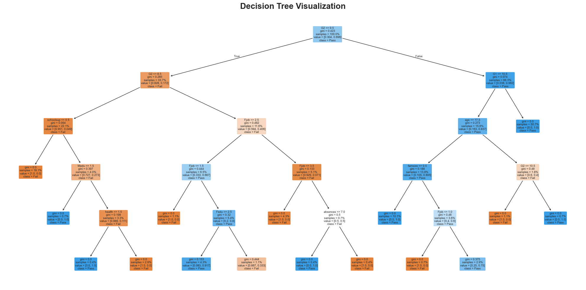

# Student Performance Prediction Using Decision Tree Classification

**Subject:** Data Mining and Data Warehousing  
**Dataset:** UCI Student Performance Dataset  
**Algorithm:** Decision Tree (CART — Gini Index)  
**Tool/Language:** Python (pandas, scikit-learn, matplotlib, seaborn)

---

## 1. Introduction

Education is one of the most critical sectors in society, and understanding the factors that influence student academic performance is key for educators, institutions, and policymakers. With the growth of educational data, data mining techniques have become a powerful tool for uncovering hidden patterns and relationships within academic datasets.

This project applies a **Decision Tree Classification algorithm** to the UCI Student Performance dataset to predict whether a student will **pass or fail** based on demographic, social, and academic attributes. The Decision Tree algorithm was chosen for its interpretability — it provides a clear, visual, rule-based structure that educators can easily understand and act upon.

### Objectives

1. Load and preprocess the UCI Student Performance dataset.
2. Perform Exploratory Data Analysis (EDA) to understand key distributions and relationships.
3. Train a Decision Tree Classifier to predict student pass/fail outcomes.
4. Evaluate the model using accuracy, confusion matrix, and classification report.
5. Identify the most important features influencing student performance.
6. Visualize the trained decision tree for interpretability.

---

## 2. Literature Survey

| # | Authors | Year | Key Contribution |
|---|---------|------|-----------------|
| 1 | Cortez & Silva | 2008 | Introduced the UCI Student Performance dataset and applied Decision Trees, Random Forests, Neural Networks, and SVMs to predict student grades. Found that past grades (G1, G2) are the strongest predictors. |
| 2 | Romero & Ventura | 2010 | Comprehensive survey of Educational Data Mining (EDM), covering classification, clustering, and association rule mining applied to educational contexts. |
| 3 | Baker & Yacef | 2009 | Reviewed the state of EDM, highlighting techniques like Decision Trees and Bayesian classifiers for predicting student performance and understanding student behaviour. |
| 4 | Kotsiantis et al. | 2004 | Compared multiple classification algorithms (Naive Bayes, Decision Trees, Neural Networks) for predicting student performance in a distance learning university. |
| 5 | Amrieh et al. | 2016 | Used Decision Trees and ensemble methods on educational data with behavioural features (participation, discussion marks) and demonstrated accuracy above 70%. |
| 6 | Shahiri et al. | 2015 | Survey of prediction methods in higher education: found that Decision Trees and Neural Networks are the most commonly used techniques for academic performance prediction. |

### Key Takeaways from Literature

- **Decision Trees** are among the most widely used and interpretable algorithms for student performance prediction.
- **Past academic performance** (prior grades) consistently emerges as the strongest predictor across studies.
- Demographic and social factors (family, study habits, health) provide additional predictive power.
- Classification accuracy in the range of **70–90%** is commonly reported in student performance studies.

---

## 3. Methods and Dataset Description

### 3.1 Dataset Description

The dataset used in this project is the **UCI Student Performance Dataset** (`student-mat.csv`), originally collected by Paulo Cortez and Alice Silva from two Portuguese secondary schools. It contains **395 student records** with **33 attributes** covering demographics, family background, study habits, and grades.

#### Attribute Summary

| Category | Attributes | Description |
|----------|-----------|-------------|
| **Demographic** | school, sex, age, address | School attended, gender, age, urban/rural |
| **Family** | famsize, Pstatus, Medu, Fedu, Mjob, Fjob, guardian | Family size, parents' cohabitation, education & jobs |
| **Academic** | traveltime, studytime, failures, schoolsup, paid, higher | Travel time, study hours, past failures, extra support |
| **Social** | activities, nursery, internet, romantic, freetime, goout | Extracurriculars, relationships, free time |
| **Health/Lifestyle** | Dalc, Walc, health, absences | Alcohol consumption, health, absences |
| **Grades** | G1, G2, G3 | First period, second period, and final grade (0–20) |

#### Key Statistics

| Statistic | Age | Study Time | Absences | G1 | G2 | G3 (Final) |
|-----------|-----|-----------|----------|----|----|------------|
| Mean | 16.70 | 2.04 | 5.71 | 10.91 | 10.71 | 10.42 |
| Std Dev | 1.28 | 0.84 | 8.00 | 3.32 | 3.76 | 4.58 |
| Min | 15 | 1 | 0 | 3 | 0 | 0 |
| Max | 22 | 4 | 75 | 19 | 19 | 20 |

### 3.2 Target Variable

A binary target variable **Result** was created from the final grade (G3):

- **Pass (1):** G3 ≥ 10 → **265 students (67.1%)**
- **Fail (0):** G3 < 10 → **130 students (32.9%)**

### 3.3 Data Preprocessing

1. **Missing Values:** No missing values were found in the dataset.
2. **Label Encoding:** All 17 categorical columns (school, sex, address, famsize, Pstatus, Mjob, Fjob, reason, guardian, schoolsup, famsup, paid, activities, nursery, higher, internet, romantic) were encoded using `LabelEncoder`.
3. **Feature & Target Split:** G3 was dropped from features (since Result is derived from it). The final feature set contains **32 features**.

### 3.4 Algorithm — Decision Tree (CART)

The **Classification and Regression Trees (CART)** algorithm was used with the following configuration:

| Parameter | Value |
|-----------|-------|
| Criterion | Gini Index |
| Max Depth | 5 |
| Random State | 42 |
| Train/Test Split | 70% / 30% |

**Why Decision Tree?**
- Highly interpretable — produces human-readable rules
- Handles both numerical and categorical features
- No feature scaling required
- Provides built-in feature importance ranking

**Gini Index** is calculated as:

```
Gini(D) = 1 - Σ (pᵢ)²
```

where `pᵢ` is the probability of class `i` in dataset `D`. The algorithm recursively selects the feature and threshold that minimize the weighted Gini impurity at each node.

---

## 4. Analysis

### 4.1 Exploratory Data Analysis

#### 4.1.1 Distribution of Final Grade (G3)

The histogram below shows the distribution of the final grade G3 across all 395 students. The red dashed line at G3 = 10 represents the pass/fail threshold.



**Observation:** The distribution is roughly normal with a slight left skew. A significant number of students score near or below the threshold (G3 = 10), indicating a substantial proportion at risk of failing.

---

#### 4.1.2 Pass vs Fail Distribution



**Observation:** The dataset is moderately imbalanced — **265 students (67.1%) passed** while **130 students (32.9%) failed**. The 2:1 ratio is manageable for classification without requiring advanced sampling techniques.

---

#### 4.1.3 Correlation Heatmap



**Key Observations:**
- **G1, G2, and G3 are highly correlated** (G2–G3: 0.91, G1–G3: 0.80), confirming that prior grades are the strongest predictors of final grades.
- **Failures** has a notable negative correlation with grades (−0.36 with G3).
- **Mother's education (Medu)** and **Father's education (Fedu)** show moderate positive correlation with grades.
- **Alcohol consumption (Dalc, Walc)** shows weak negative correlation with academic performance.

---

#### 4.1.4 Study Time vs Pass Rate



**Observation:** Students who study more tend to have higher pass rates. The pass rate increases with study time, suggesting study habits are positively associated with academic success.

---

#### 4.1.5 Past Failures vs Pass Rate



**Observation:** Students with zero past failures have the highest pass rate. As the number of past failures increases, the pass rate drops dramatically — students with 3 or more failures show a very low pass rate, highlighting academic history as a strong predictor.

---

### 4.2 Model Results

#### 4.2.1 Accuracy

| Metric | Value |
|--------|-------|
| **Overall Accuracy** | **86.55%** |
| Training Samples | 276 (70%) |
| Testing Samples | 119 (30%) |

---

#### 4.2.2 Confusion Matrix



| | Predicted Fail | Predicted Pass |
|---|---|---|
| **Actual Fail** | 39 (TN) | 7 (FP) |
| **Actual Pass** | 9 (FN) | 64 (TP) |

- **True Negatives (39):** Correctly identified 39 out of 46 failing students.
- **True Positives (64):** Correctly identified 64 out of 73 passing students.
- **False Positives (7):** 7 failing students were incorrectly predicted as passing.
- **False Negatives (9):** 9 passing students were incorrectly predicted as failing.

---

#### 4.2.3 Classification Report

| Class | Precision | Recall | F1-Score | Support |
|-------|-----------|--------|----------|---------|
| Fail (0) | 0.81 | 0.85 | 0.83 | 46 |
| Pass (1) | 0.90 | 0.88 | 0.89 | 73 |
| **Weighted Avg** | **0.87** | **0.87** | **0.87** | **119** |

- **Precision (Pass = 0.90):** When the model predicts a student will pass, it is correct 90% of the time.
- **Recall (Pass = 0.88):** The model correctly identifies 88% of students who actually pass.
- **F1-Score:** The harmonic mean of precision and recall is well-balanced for both classes, indicating robust performance without heavy class bias.

---

### 4.3 Feature Importance



**Top 10 Most Important Features:**

| Rank | Feature | Importance Score |
|------|---------|-----------------|
| 1 | **G2** (2nd period grade) | 0.7648 |
| 2 | **Fjob** (Father's job) | 0.1033 |
| 3 | **Medu** (Mother's education) | 0.0234 |
| 4 | **famsize** (Family size) | 0.0213 |
| 5 | **age** | 0.0195 |
| 6 | **health** | 0.0161 |
| 7 | **G1** (1st period grade) | 0.0157 |
| 8 | **Fedu** (Father's education) | 0.0148 |
| 9 | **schoolsup** (School support) | 0.0121 |
| 10 | **absences** | 0.0090 |

**Key Insight:** **G2 (second period grade) dominates** with an importance score of **0.7648** — it alone accounts for ~76% of the decision-making. This aligns with the literature: the most recent prior academic performance is overwhelmingly the strongest predictor of the final outcome.

---

### 4.4 Decision Tree Visualization

The trained Decision Tree (max depth = 5, 16 leaf nodes) is visualized below:



The tree shows how the model splits data at each node based on feature thresholds. The root node splits on **G2 ≤ 9.5**, confirming G2's dominant role. Nodes are color-coded — **blue for Pass** and **orange for Fail** — with darker shades representing higher class purity.

---

## 5. References

1. Cortez, P., & Silva, A. (2008). *Using Data Mining to Predict Secondary School Student Performance*. Proceedings of the 5th Future Business Technology Conference (FUBUTEC), pp. 5–12.

2. Romero, C., & Ventura, S. (2010). *Educational Data Mining: A Review of the State of the Art*. IEEE Transactions on Systems, Man, and Cybernetics, Part C, 40(6), pp. 601–618.

3. Baker, R.S.J.d., & Yacef, K. (2009). *The State of Educational Data Mining in 2009: A Review and Future Visions*. Journal of Educational Data Mining, 1(1), pp. 3–17.

4. Kotsiantis, S., Pierrakeas, C., & Pintelas, P. (2004). *Predicting Students' Performance in Distance Learning Using Machine Learning Techniques*. Applied Artificial Intelligence, 18(5), pp. 411–426.

5. Amrieh, E.A., Hamtini, T., & Aljarah, I. (2016). *Mining Educational Data to Predict Student's Academic Performance Using Ensemble Methods*. International Journal of Database Theory and Application, 9(8), pp. 119–136.

6. Shahiri, A.M., Husain, W., & Rashid, N.A. (2015). *A Review on Predicting Student's Performance Using Data Mining Techniques*. Procedia Computer Science, 72, pp. 414–422.

7. UCI Machine Learning Repository — Student Performance Dataset. Available at: [https://archive.ics.uci.edu/ml/datasets/Student+Performance](https://archive.ics.uci.edu/ml/datasets/Student+Performance)

8. Scikit-learn Documentation — Decision Trees. Available at: [https://scikit-learn.org/stable/modules/tree.html](https://scikit-learn.org/stable/modules/tree.html)

---
