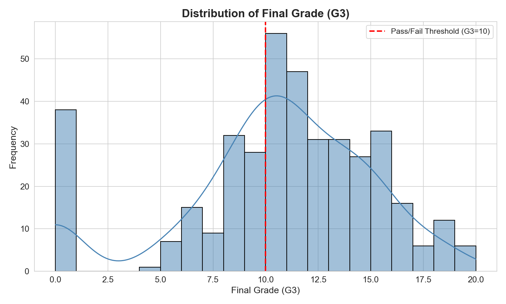
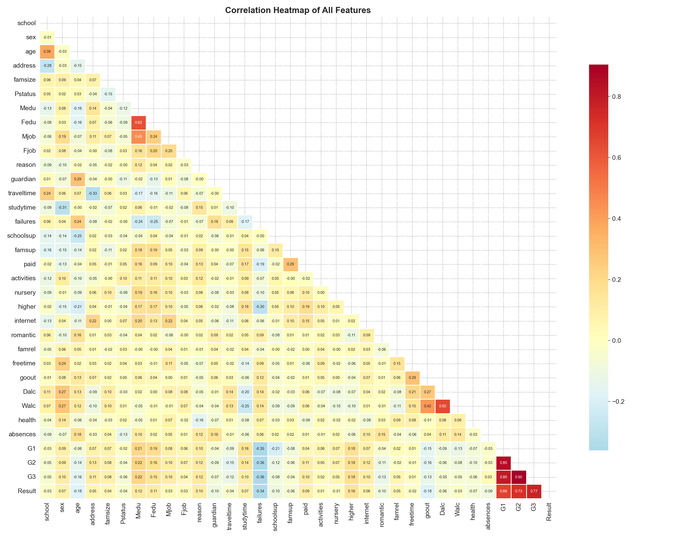
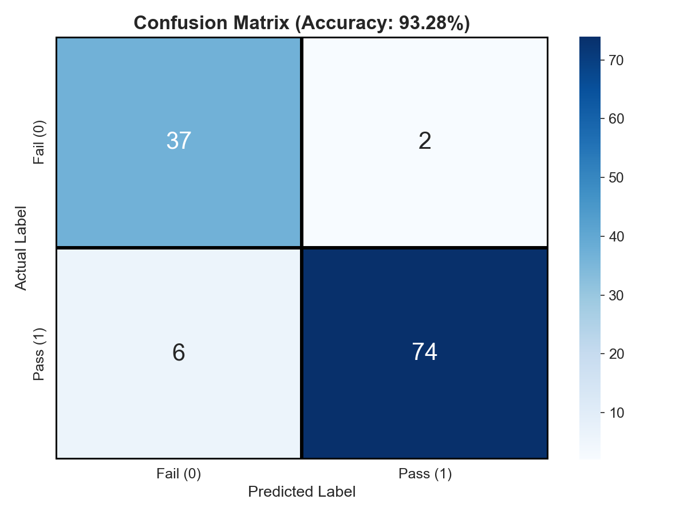
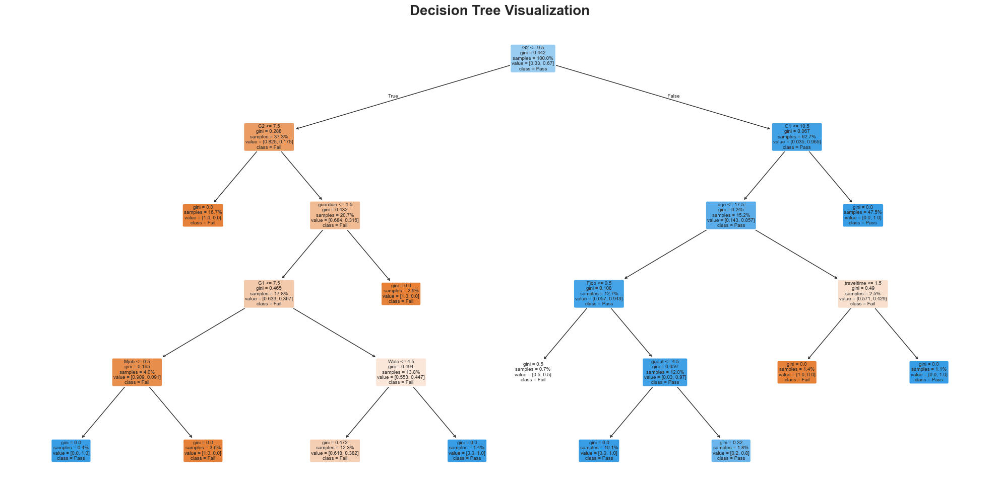

# Student Performance Analysis Using Decision Tree, OLAP, and Apriori

This repository contains a student performance prediction project built using the UCI Student Performance dataset.

The project uses the `student-mat.csv` dataset and combines multiple data mining techniques:

- `OLAP` style grouped summaries and pivot-table analysis
- `Apriori` association rule mining
- `Decision Tree` classification for pass/fail prediction

The goal is to show both descriptive and predictive analysis on student performance based on study time, past failures, family background, support systems, absences, and previous grades.

## What this project does

- loads the student dataset
- preprocesses the data
- encodes categorical columns
- creates a pass/fail target using `G3`
- performs OLAP queries using grouped summaries and pivot tables
- performs Apriori association analysis on student behavior patterns
- trains a Decision Tree classifier
- evaluates the model using accuracy, confusion matrix, and classification report
- saves graphs in the `graphs/` folder
- saves OLAP and Apriori output tables in the `analysis_outputs/` folder

## Main result

- Accuracy: `93.28%`
- Dataset size: `395` records
- Features used for training: `32`
- Techniques used: `OLAP + Apriori + Decision Tree`
- Target:
  `Pass = G3 >= 10`
  `Fail = G3 < 10`

## Files in this repo

- `student_performance_analysis.py` - main Python file
- `student_performance_analysis.ipynb` - notebook version of the project
- `archive/student-mat.csv` - dataset used in the project
- `graphs/` - all generated graphs
- `analysis_outputs/` - saved OLAP tables and Apriori results
- `requirements.txt` - libraries needed to run the project
- `Student_Performance_Project_Report_dm.md` - report source

## Graphs generated

- `g3_distribution.png`
- `pass_fail_countplot.png`
- `correlation_heatmap.png`
- `studytime_vs_result.png`
- `failures_vs_result.png`
- `confusion_matrix.png`
- `feature_importance.png`
- `decision_tree.png`

## Sample visuals

### Final grade distribution



### Correlation heatmap



### Confusion matrix



### Decision tree



## Analysis outputs generated

- `olap_pass_rate_by_sex_studytime.csv`
- `olap_grade_summary_school_sex.csv`
- `olap_support_factors.csv`
- `olap_cube_studytime_failures_internet.csv`
- `apriori_frequent_itemsets.csv`
- `apriori_association_rules.csv`

## How to run

Install the required libraries:

```bash
python3 -m pip install -r requirements.txt
```

Then run the project:

```bash
python3 student_performance_analysis.py
```

## Tools used

- Python
- pandas
- numpy
- matplotlib
- seaborn
- scikit-learn
- custom Apriori implementation using Python combinations

## Future improvements

- compare Decision Tree with other machine learning models
- add cross-validation for better evaluation
- add dashboard-style OLAP visualizations
- improve the project structure and documentation over time
