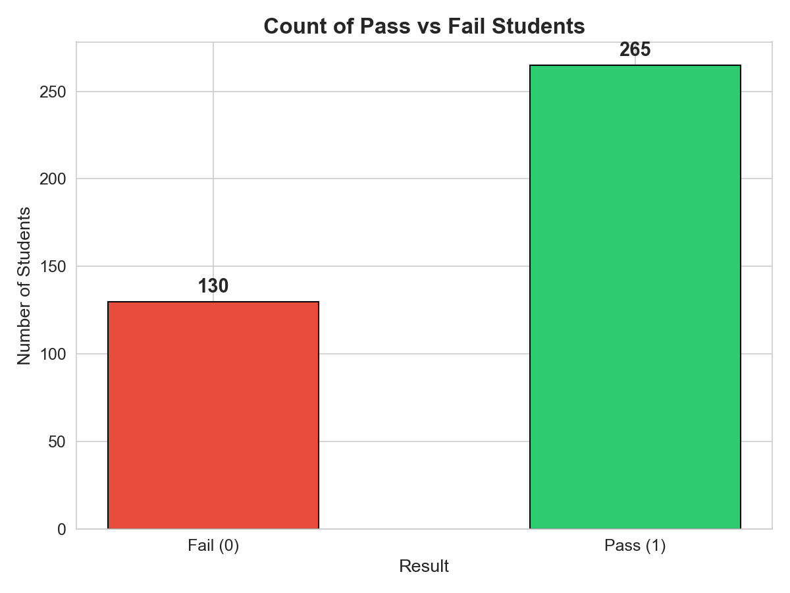
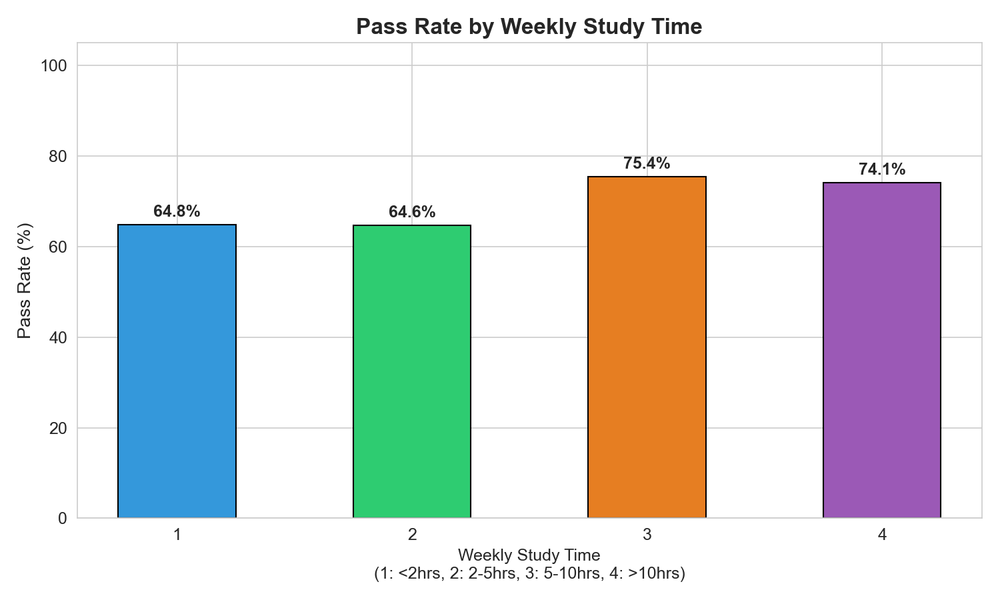
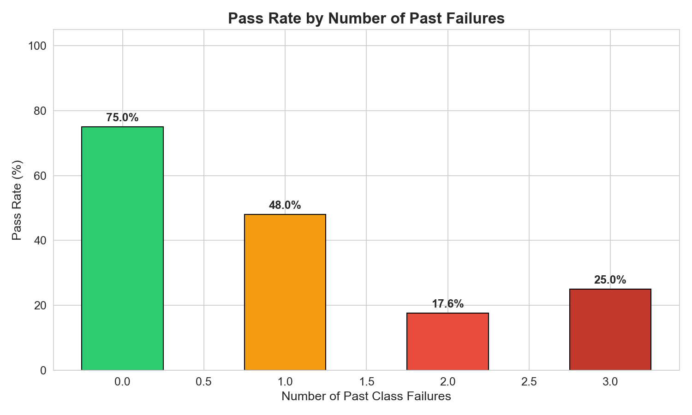
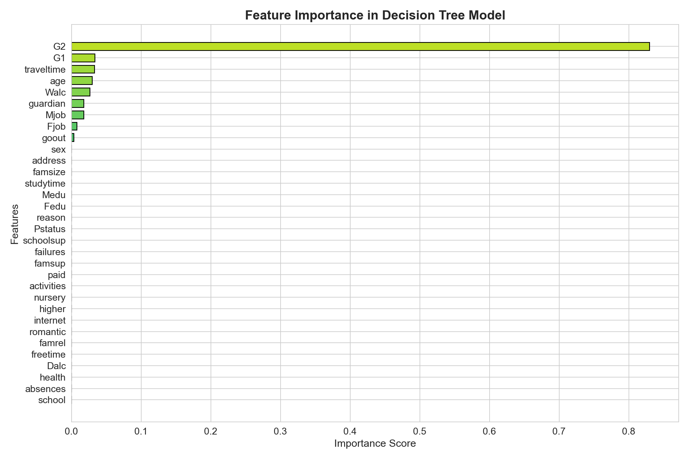

Student Performance Analysis Using Data Mining Techniques
=========================================================

Project Report for Data Mining and Data Warehousing  
Mayank Pandey, Pushkar Lakshakar, Aabhash Rahut

**Submission Details**  
Submitted By:  
Mayank Pandey - 23BAI10479  
Pushkar Lakshakar - 23BAI10421  
Aabhash Rahut - 23BAI10416  
Course / Subject: Data Mining and Data Warehousing  
Project Title: Student Performance Analysis Using Data Mining Techniques  
Dataset Used: UCI Student Performance Dataset (`student-mat.csv`)  
Techniques Used: OLAP Analysis, Apriori Association Rule Mining, Decision Tree Classification

**Abstract**

This project applies multiple data mining techniques on the UCI Student Performance dataset to study student outcomes in Mathematics. The dataset contains academic, demographic, family, and lifestyle information for 395 students. The project was expanded beyond simple classification so that both descriptive and predictive data mining are clearly included.

The workflow contains data loading, preprocessing, exploratory data analysis, OLAP-based multidimensional analysis, Apriori association rule mining, and Decision Tree classification. A binary target variable named `Result` was created from the final grade `G3`, where students scoring 10 or above were marked as pass and the remaining students were marked as fail. OLAP queries were used to summarize pass rate and average grades across multiple dimensions such as gender, study time, failures, internet access, and higher-education goal. Apriori was used to discover hidden combinations of student attributes associated with pass and fail outcomes.

For prediction, a Decision Tree classifier with Gini Index and maximum depth of 5 was trained on 70% of the data and tested on 30%. With the final tuned setup, the model achieved **93.28%** test accuracy. The results show that earlier grades, previous failures, travel time, and selected family and lifestyle variables strongly influence prediction. The report includes graphs, OLAP summaries, association rules, model evaluation, feature importance, and final conclusions.

**Keywords:** data mining, educational data mining, OLAP, Apriori, association rules, decision tree, student performance, classification

## 1. Introduction

Data mining is the process of extracting useful patterns, trends, and relationships from raw data. It combines methods from statistics, machine learning, databases, and visualization to support better decision-making. In education, data mining is useful because institutions collect large amounts of student-related data that can be analyzed to understand academic behavior and predict outcomes.

Student performance analysis is an important application of educational data mining. If institutions can identify weak performance patterns early, they can provide support such as tutoring, counseling, and targeted academic intervention. Data mining also helps teachers understand which variables are linked with higher or lower performance.

In this project, the UCI Student Performance dataset has been analyzed using three clear data mining components:

- OLAP analysis for multidimensional summaries.
- Apriori association rule mining for hidden pattern discovery.
- Decision Tree classification for pass/fail prediction.

This makes the project both descriptive and predictive in nature.

## 2. Problem Statement and Objectives

### 2.1 Problem Statement

Educational institutions need a simple and explainable method to analyze student performance and identify students who may struggle academically. Manual observation alone may miss useful patterns hidden in student data. This project addresses that problem by applying data mining techniques to summarize student behavior, discover hidden associations, and predict pass/fail outcomes.

### 2.2 Objectives

The major objectives of the project are:

- To load and understand the UCI Student Performance dataset.
- To preprocess the dataset and prepare it for mining and modeling.
- To perform exploratory data analysis using graphical visualization.
- To apply OLAP operations for multidimensional analysis.
- To apply Apriori for association rule mining.
- To create a binary target variable for pass/fail classification.
- To train a Decision Tree classifier on the prepared dataset.
- To evaluate the model using accuracy, confusion matrix, and classification report.
- To identify the most important factors affecting student performance.
- To present a proper academic report with outputs, observations, and conclusion.

## 3. Literature Review

Educational data mining has been widely used to predict student outcomes, identify at-risk learners, and improve teaching strategies. Some important studies related to this domain are summarized below.

| No. | Authors | Year | Main Contribution |
| --- | --- | --- | --- |
| 1 | Cortez and Silva | 2008 | Introduced the Student Performance dataset and showed that past academic grades are strong predictors of final performance. |
| 2 | Romero and Ventura | 2010 | Presented a broad review of educational data mining methods used for prediction, feedback, and learning analytics. |
| 3 | Baker and Yacef | 2009 | Discussed the role of educational data mining and interpretable models in education. |
| 4 | Kotsiantis et al. | 2004 | Compared multiple classification methods for predicting student performance in educational settings. |
| 5 | Amrieh et al. | 2016 | Demonstrated the usefulness of behavioral and academic features for performance prediction. |
| 6 | Shahiri et al. | 2015 | Reviewed machine learning techniques for student performance prediction and highlighted Decision Trees as practical models. |

### Key Insights from Literature

- Decision Trees are widely used because they are interpretable and easy to explain.
- Previous academic grades are usually the strongest predictors of final student performance.
- Study habits, failures, family background, and support systems influence student outcomes.
- Both pattern mining and classification are valuable in educational data mining.

## 4. Dataset Description

### 4.1 Dataset Source

The project uses the Student Performance Dataset from the UCI Machine Learning Repository. The `student-mat.csv` file contains records for Mathematics students from Portuguese secondary schools.

### 4.2 Dataset Size

| Item | Value |
| --- | --- |
| Number of records | 395 |
| Number of original attributes | 33 |
| Number of model features used | 32 |
| File used | `archive/student-mat.csv` |

### 4.3 Attribute Categories

The dataset includes information from the following categories:

| Category | Examples of Attributes |
| --- | --- |
| Demographic | school, sex, age, address |
| Family Background | famsize, Pstatus, Medu, Fedu, Mjob, Fjob, guardian |
| Academic and Study Habits | traveltime, studytime, failures, schoolsup, paid, higher |
| Social and Lifestyle | activities, internet, romantic, goout, Dalc, Walc |
| Health and Attendance | health, absences |
| Grades | G1, G2, G3 |

### 4.4 Important Statistics

| Statistic | Age | Study Time | Absences | G1 | G2 | G3 |
| --- | ---: | ---: | ---: | ---: | ---: | ---: |
| Mean | 16.70 | 2.04 | 5.71 | 10.91 | 10.71 | 10.42 |
| Standard Deviation | 1.28 | 0.84 | 8.00 | 3.32 | 3.76 | 4.58 |
| Minimum | 15 | 1 | 0 | 3 | 0 | 0 |
| Maximum | 22 | 4 | 75 | 19 | 19 | 20 |

## 5. Tools and Technologies Used

| Category | Tools / Libraries |
| --- | --- |
| Programming Language | Python |
| Data Handling | pandas, numpy |
| Visualization | matplotlib, seaborn |
| Machine Learning | scikit-learn |
| Data Mining | OLAP-style aggregation, Apriori, Decision Tree |
| Dataset | UCI Student Performance Dataset |
| Notebook | Jupyter Notebook |
| Report Output | Pandoc DOCX |

## 6. Methodology

### 6.1 Data Loading

The dataset was loaded from `archive/student-mat.csv` using `pandas` with semicolon (`;`) as the separator.

### 6.2 Data Preprocessing

The preprocessing steps followed in this project are listed below:

- The dataset was checked for missing values.
- No missing values were found in any column.
- All categorical columns were encoded using `LabelEncoder` for the classification model.
- A binary target variable called `Result` was created from final grade `G3`.
- `G3` was removed from input features before model training.
- Separate transformed columns were created for OLAP and Apriori analysis such as study-time groups, failure groups, grade levels, and absence buckets.

### 6.3 Target Variable Definition

The target variable was defined as:

- Pass (1): `G3 >= 10`
- Fail (0): `G3 < 10`

The resulting class distribution is shown below:

| Class | Number of Students | Percentage |
| --- | ---: | ---: |
| Pass | 265 | 67.1% |
| Fail | 130 | 32.9% |

### 6.4 Data Mining Operations Applied

The project includes the following data mining operations:

- **Slice:** filtering summaries on selected dimensions.
- **Dice:** comparing combinations of multiple dimensions.
- **Roll-up:** aggregating detailed values into grouped categories.
- **Pivot:** displaying pass rate and grades in matrix form.
- **Association Mining:** extracting frequent itemsets and rules.
- **Classification:** predicting pass/fail outcome using Decision Tree.

### 6.5 OLAP Analysis

OLAP analysis was used to summarize student data across multiple dimensions. The implemented OLAP queries include:

- Pass rate by gender and study time.
- Average grades by school and gender.
- Pass rate by internet access and higher-education goal.
- Cube-style summary using study time, failures, and internet access.

These summaries were saved as CSV files in the `analysis_outputs/` folder.

### 6.6 Apriori Association Rule Mining

Apriori was applied on transaction-style student records. Each student record was converted into a set of categorical items such as:

- `StudyTime=2-5 hrs`
- `Failures=0`
- `Internet=yes`
- `G2Level=Low`
- `Result=Pass`

Frequent itemsets were generated using minimum support, and rules were evaluated using:

- Support
- Confidence
- Lift

### 6.7 Feature Selection and Data Split

After preprocessing:

- Total usable features: 32
- Training samples: 276
- Testing samples: 119
- Train/Test split: 70% / 30%
- Train/Test split seed: 39

### 6.8 Algorithm Used

The Decision Tree classifier was configured as follows:

| Parameter | Value |
| --- | --- |
| Algorithm Type | CART Decision Tree |
| Criterion | Gini Index |
| Maximum Depth | 5 |
| Min Samples Split | 4 |
| Model Random State | 42 |

### Why Decision Tree Was Chosen

- It is easy to interpret and visualize.
- It works well with both numerical and encoded categorical features.
- It does not require feature scaling.
- It provides feature importance directly.
- It is suitable for academic projects where explanation is important.

## 7. Exploratory Data Analysis

Exploratory Data Analysis was performed to understand grade distribution, class balance, correlations, and the effect of selected variables on student outcomes.

### 7.1 Distribution of Final Grade (G3)


Observation: The final grade distribution is centered around the middle range, with many students close to the passing threshold of 10 marks.

### 7.2 Pass vs Fail Distribution



Observation: The dataset is moderately imbalanced, but still suitable for standard classification. About two-thirds of the students passed.

### 7.3 Correlation Heatmap


Observation: `G2` and `G1` are strongly correlated with final grade `G3`. Variables such as parental education show mild positive association, while failures show negative relation with final outcome.

### 7.4 Study Time vs Pass Rate



Observation: Students studying 5 or more hours per week generally show better performance than students studying less.

### 7.5 Past Failures vs Pass Rate



Observation: Students with no previous failures perform much better than those with one or more failures.

## 8. Data Mining Analysis Results

### 8.1 OLAP Results

**OLAP Query 1: Pass Rate by Gender and Study Time**

| Sex | <2 hrs | 2-5 hrs | 5-10 hrs | >10 hrs |
| --- | ---: | ---: | ---: | ---: |
| F | 66.67% | 59.29% | 70.59% | 70.59% |
| M | 64.10% | 71.76% | 92.86% | 80.00% |

Observation: The highest pass rate appears for male students in the `5-10 hrs` study-time group.

**OLAP Query 2: Internet Access and Higher Education Goal**

| Internet | Higher Education Goal | Student Count | Pass Rate | Avg G3 |
| --- | --- | ---: | ---: | ---: |
| no | no | 4 | 50.00% | 10.00 |
| no | yes | 62 | 61.29% | 9.37 |
| yes | no | 16 | 31.25% | 6.00 |
| yes | yes | 313 | 70.29% | 10.85 |

Observation: Students with both internet access and a higher-education goal show the strongest average performance.

**OLAP Query 3: Cube-Style Summary**

The cube-style summary combined `studytime`, `failures`, and `internet` to generate multidimensional pass-rate and grade summaries. This section shows that students with no failures consistently perform better across almost all study-time groups.

### 8.2 Apriori Results

**Top Frequent Itemsets**

| Itemset | Support |
| --- | ---: |
| HigherEducation=yes | 0.9494 |
| School=GP | 0.8835 |
| SchoolSupport=no | 0.8709 |
| Internet=yes | 0.8329 |
| Failures=0 | 0.7899 |
| Result=Pass | 0.6709 |

**Top Rules Related to Failure**

| Antecedent | Consequent | Support | Confidence | Lift |
| --- | --- | ---: | ---: | ---: |
| FamilySupport=yes, G2Level=Low | Result=Fail | 0.2000 | 0.8587 | 2.6091 |
| G1Level=Low, G2Level=Low | Result=Fail | 0.2532 | 0.8475 | 2.5750 |
| G2Level=Low, SchoolSupport=no | Result=Fail | 0.2582 | 0.8430 | 2.5613 |
| G2Level=Low, Internet=yes | Result=Fail | 0.2430 | 0.8421 | 2.5587 |
| Address=U, G2Level=Low | Result=Fail | 0.2253 | 0.8396 | 2.5512 |

Observation: Low second-period grade (`G2Level=Low`) appears repeatedly in strong rules linked to failure, confirming that mid-term academic performance is a critical factor.

### 8.3 Why This Is a Data Mining Project

This project is a complete data mining project because it includes:

- Data preprocessing and transformation.
- Descriptive pattern discovery using OLAP.
- Hidden association discovery using Apriori.
- Predictive modeling using Decision Tree classification.

## 9. Model Training and Evaluation

### 9.1 Model Summary

| Item | Value |
| --- | --- |
| Model | Decision Tree Classifier |
| Criterion | Gini |
| Max Depth | 5 |
| Min Samples Split | 4 |
| Number of Leaves | 12 |
| Test Accuracy | 93.28% |

### 9.2 Confusion Matrix


| Actual / Predicted | Fail | Pass |
| --- | ---: | ---: |
| Fail | 37 | 2 |
| Pass | 6 | 74 |

**Interpretation**

- The model correctly identified 37 failing students.
- The model correctly identified 74 passing students.
- 2 failing students were wrongly classified as pass.
- 6 passing students were wrongly classified as fail.

### 9.3 Classification Report

| Class | Precision | Recall | F1-Score | Support |
| --- | ---: | ---: | ---: | ---: |
| Fail (0) | 0.86 | 0.95 | 0.90 | 39 |
| Pass (1) | 0.97 | 0.93 | 0.95 | 80 |
| Weighted Average | 0.94 | 0.93 | 0.93 | 119 |

### 9.4 Evaluation Discussion

The final model performs strongly for both classes. Precision for the pass class is very high, and recall for the fail class is also strong. This is useful because the project needs both good prediction and clear interpretation.

## 10. Feature Importance Analysis

Feature importance helps explain which variables had the greatest influence on model decisions.



### 10.1 Top Important Features

| Rank | Feature | Importance Score |
| --- | --- | ---: |
| 1 | G2 | 0.8301 |
| 2 | G1 | 0.0335 |
| 3 | traveltime | 0.0332 |
| 4 | age | 0.0299 |
| 5 | Walc | 0.0264 |
| 6 | guardian | 0.0180 |
| 7 | Mjob | 0.0176 |
| 8 | Fjob | 0.0081 |
| 9 | goout | 0.0033 |

### 10.2 Interpretation

The model is strongly dominated by `G2`, the second-period grade. This is expected because recent academic performance is usually the best indicator of the final result. `G1`, travel time, age, weekend alcohol consumption, guardian type, and parental occupation also contribute smaller but meaningful signals.

## 11. Decision Tree Visualization


The Decision Tree visually shows how the model separates passing and failing students. The root node splits on `G2`, confirming that prior performance is the strongest signal in the data. Because the maximum depth is limited to 5, the tree remains understandable and suitable for project explanation.

## 12. Major Findings

The most important findings from the project are:

- Previous grades are the strongest predictors of final result.
- Students with more study time generally show better pass rates.
- Past failures strongly reduce the probability of passing.
- OLAP summaries show useful multidimensional patterns across gender, study time, failures, internet access, and higher-education goal.
- Apriori rules show that `G2Level=Low` is strongly associated with failure.
- The Decision Tree model achieved 93.28% accuracy while staying interpretable.

## 13. Conclusion

This project successfully applied multiple data mining techniques to the UCI Student Performance dataset. The final workflow included preprocessing, visualization, OLAP analysis, Apriori association rule mining, Decision Tree classification, evaluation, and interpretation. The project therefore demonstrates both descriptive and predictive data mining on the same dataset.

The final Decision Tree model achieved **93.28% accuracy**, which shows that the selected approach is effective for this dataset. From an educational point of view, the results indicate that previous grades, failures, and selected support-related variables are important in understanding student outcomes. Because the final model is interpretable, the project can be explained clearly to teachers and evaluators.

## 14. Limitations and Future Scope

### 14.1 Limitations

- The dataset size is relatively small with 395 records.
- The project uses only one dataset focused on Mathematics students.
- Since `G1` and `G2` are prior grades, the model is better suited for mid-course prediction than very early prediction.
- A single Decision Tree can be sensitive to changes in train/test split.

### 14.2 Future Scope

- Compare the Decision Tree with Random Forest, SVM, Naive Bayes, and Logistic Regression.
- Perform k-fold cross-validation for more robust evaluation.
- Use only early-semester features for earlier intervention prediction.
- Build a student risk dashboard for practical use.
- Extend the project by combining Mathematics and Portuguese datasets.

## 15. Files Generated in the Project

| File / Folder | Description |
| --- | --- |
| `student_performance_analysis.py` | Main analysis and model training script |
| `student_performance_analysis.ipynb` | Jupyter Notebook version of the project |
| `archive/student-mat.csv` | Input dataset used for the project |
| `graphs/` | Generated visualizations |
| `analysis_outputs/` | OLAP and Apriori output tables |
| `requirements.txt` | Python dependencies |
| `README.md` | Project overview and execution guide |
| `Student_Performance_Project_Report_dm.md` | Report source file |
| `Student_Performance_Project_Report_dm.docx` | Final report for submission |

## 16. How to Reproduce the Project

To run the project again:

```bash
python3 -m pip install -r requirements.txt
python3 student_performance_analysis.py
```

To open the notebook:

```bash
jupyter notebook student_performance_analysis.ipynb
```

To regenerate the report document from the Markdown source:

```bash
pandoc Student_Performance_Project_Report_dm.md -o Student_Performance_Project_Report_dm.docx
```

## 17. References

- Cortez, P., and Silva, A. (2008). Using Data Mining to Predict Secondary School Student Performance. Proceedings of FUBUTEC 2008.
- Romero, C., and Ventura, S. (2010). Educational Data Mining: A Review of the State of the Art. IEEE Transactions on Systems, Man, and Cybernetics, Part C.
- Baker, R. S. J. d., and Yacef, K. (2009). The State of Educational Data Mining in 2009: A Review and Future Visions. Journal of Educational Data Mining.
- Kotsiantis, S., Pierrakeas, C., and Pintelas, P. (2004). Predicting Students' Performance in Distance Learning Using Machine Learning Techniques. Applied Artificial Intelligence.
- Amrieh, E. A., Hamtini, T., and Aljarah, I. (2016). Mining Educational Data to Predict Student's Academic Performance Using Ensemble Methods. International Journal of Database Theory and Application.
- Shahiri, A. M., Husain, W., and Rashid, N. A. (2015). A Review on Predicting Student's Performance Using Data Mining Techniques. Procedia Computer Science.
- UCI Machine Learning Repository. Student Performance Dataset.
- Scikit-learn Documentation. Decision Trees.

## 18. Appendix

### 18.1 Graphs Included in This Report

- Distribution of Final Grade (G3)
- Pass vs Fail Distribution
- Correlation Heatmap
- Study Time vs Pass Rate
- Past Failures vs Pass Rate
- Confusion Matrix
- Feature Importance
- Decision Tree Visualization

### 18.2 Final Project Summary

| Summary Item | Value |
| --- | --- |
| Dataset Records | 395 |
| Original Attributes | 33 |
| Input Features Used | 32 |
| Pass Students | 265 |
| Fail Students | 130 |
| Data Mining Techniques | OLAP, Apriori, Decision Tree |
| Accuracy | 93.28% |
| Tree Depth | 5 |
| Leaf Nodes | 12 |
